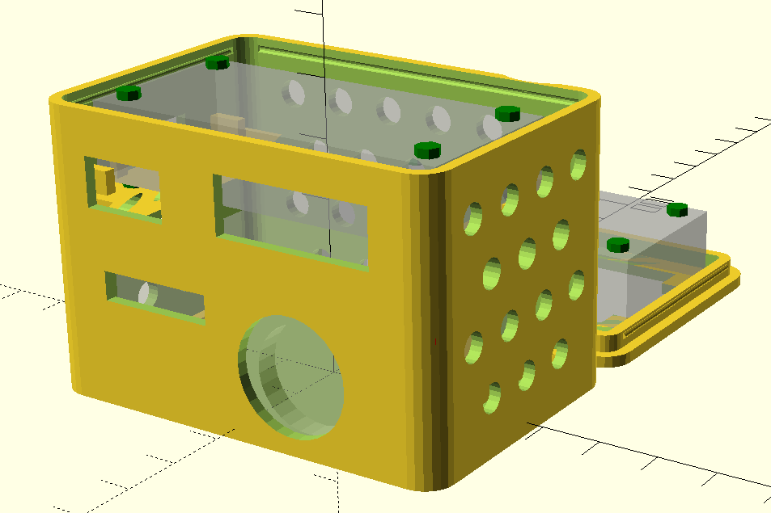
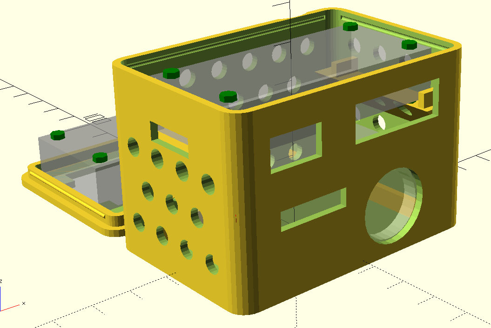
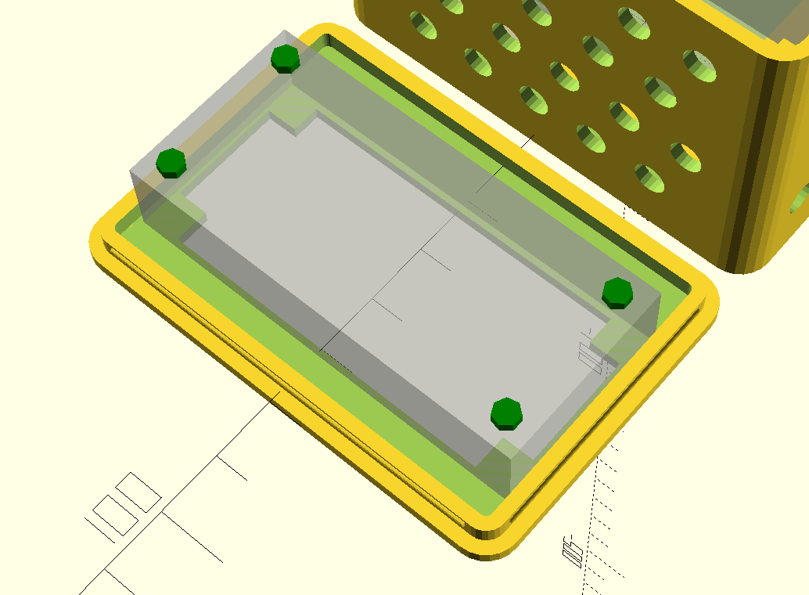

# Enviro+ Case

Case for an Enviro+ setup with PMS5003 particle sensor.  This case differs from other case designs because it doesn't require any screws or extra hardware to put the case together (just the standoffs for Pi HATs).  The interior of the case has supports to hold the particle sensor and the pi in place and the top is held in place by friction fit.

## Sensors Parts List

The case is designed to fit these specific pieces (including the specific height of the standoffs).

- Raspberry Pi Zero WH (with headers)
- Pimoroni Enviro+
- M2.5 Standoffs, [these ones](https://shop.pimoroni.com/products/brass-m2-5-standoffs-for-pi-hats-black-plated-pack-of-2)
- PMS5003 Particulate Matter Sensor (with cable)

## Printing

The case was printed using an Ender 3 v2 with all stock hardware and Hatchbox Black 1.75mm PLA.  Export the scad file into an STL and slice with your favorite slicer.

## Original Design

The case design was based off of [this box with snap on cover by Inhumierer on Thingiverse](https://www.thingiverse.com/thing:2411898).  Dimensions, supports, and cut outs were added to the design.